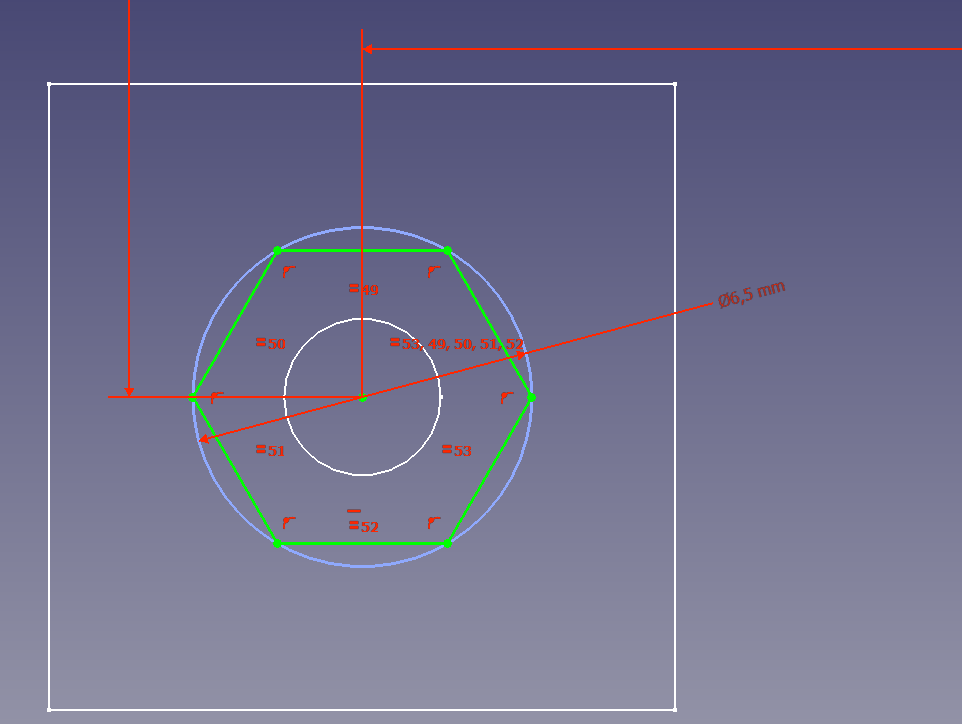
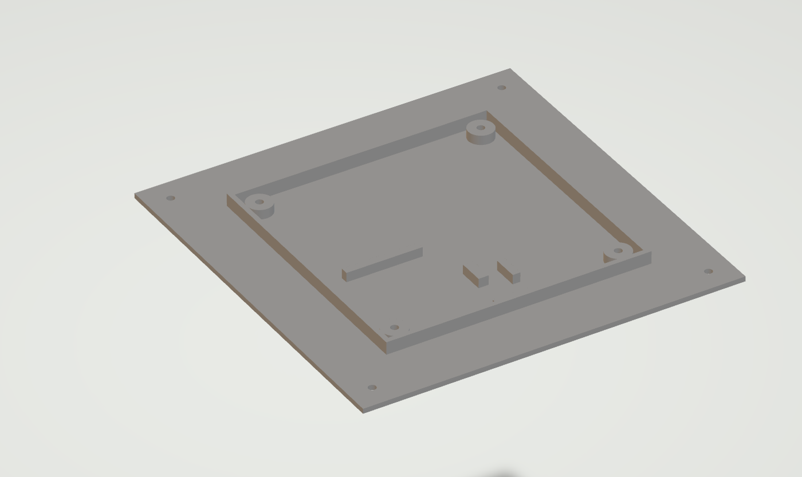
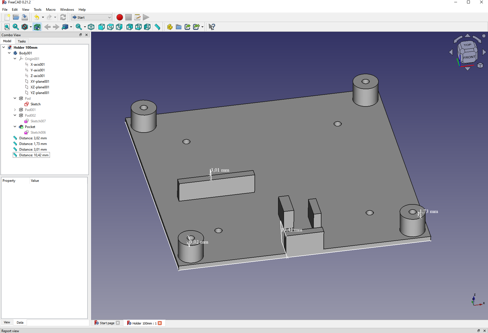
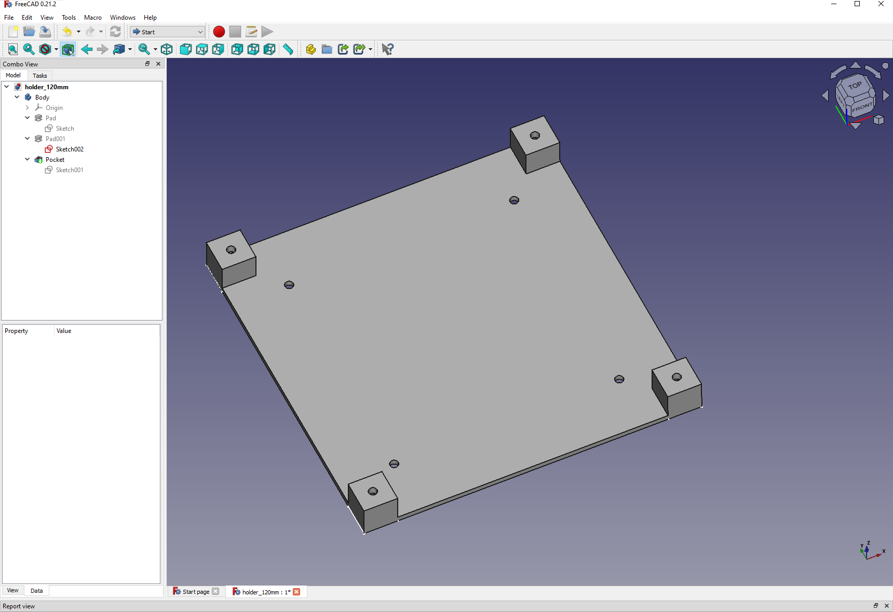
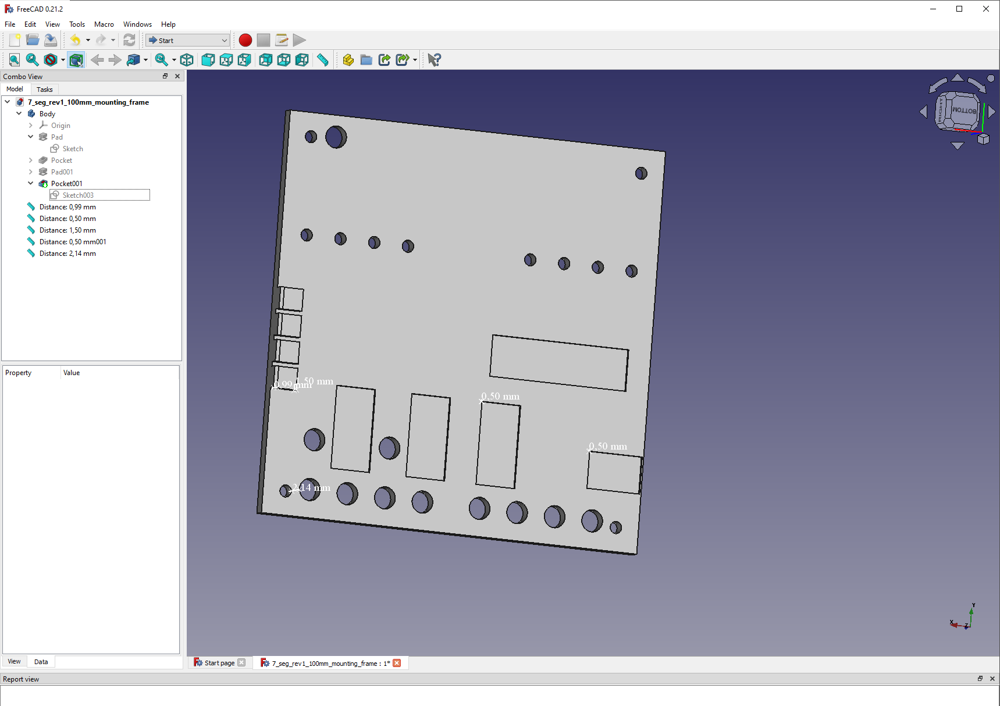

# Table of contents:
- [Table of contents:](#table-of-contents)
- [1 Introduction:](#1-introduction)
- [2 Holders:](#2-holders)
  - [2.1 The legacy from pcb revision 1:](#21-the-legacy-from-pcb-revision-1)
  - [2.2 The final version for pcb revision 1](#22-the-final-version-for-pcb-revision-1)
  - [2.3 The holder to display the failings of revision 0:](#23-the-holder-to-display-the-failings-of-revision-0)
- [3 Assembly Tools:](#3-assembly-tools)
  - [3.1 Mounting Frame](#31-mounting-frame)
  - [3.2 Resistor Lead Bender:](#32-resistor-lead-bender)

__________
# 1 Introduction:
Originally I made cutouts in plywood to make a holder that didn't interfer with the soldering-points. This approach proved inneficent and innacurate.

I therefore ordered holders that allowed to mount over these holes, these where unecessarrily big, but taught me about wall-thickness and showed me one can place m3-nuts in a hexagon pocket.
The pocket in question is a hexagon constrained by a cicle with the diameter 6.5mm:

# 2 Holders:
## 2.1 The legacy from pcb revision 1:
Since the first version of the PCB (revision 0) proved to not work verry well, and revision 1 being 100x100mm instead of 120x120mm in size I needed something to make the holders I had built and painted useable for revision 1.

Like mentioned in the introduction the first holder was to be mounted above a hole made in the first version of the plywood holders, so it needed to have a flat mounting outside that 100x100mm hole that was there to provide clearence for the 120x120mm pcb_rev0. Therefore this versions baseplate is 150x150mm in size, which is larger than the 100x100mm needed for revision 1:

This version also included walls and can be downloaded from [here](./holders/legacy/2-7mm_pocket_hex_1mm_bottom_1.stl).
The walls of this holder where meant to prevent a curious 3-year old from inserting a prying tool between the PCB and the surface it was mounted to.

The likelyhood of such prying is minimal, but the added security that came with a minimal addition was something I deemed worthwhile.

## 2.2 The final version for pcb revision 1
Like mentioned in section 2.1 the first holder was bulky, and even though the walls added protection against prying-tools they added cost in materials.

So the version I ordered for the final version is instead meant to be mounted inside a 100x100mm hole cutout into 12mm thick plywood, this approach will make the top of the PCB remain slick against the top of the plywood, and make it seem to be part of the plywood.

The STL can be downloaded [here](./holders/2024-03-13_order/holder_100mm_12mm_plywood.stl). My use of measures and notation hint at how little I bothered to perfect my understanding of freecad; but I argue that one only needs to open [this file](./holders/Holder%20100mm.FCStd) and one can print any type of measurements at any time, this is one of the strength of opensource.

## 2.3 The holder to display the failings of revision 0:
Since I want to keep the failings as remindments of my ability to solve and carry on I also made a holder for the 120x120mm PCB revision 0 for mounting onto walls or holders/displays:

[The STL](./holders/2024-03-13_order/holder_120mm-SquareCorners_10mm.stl) and [the CAD](./holders/legacy/holder_120mm.FCStd).
# 3 Assembly Tools:

## 3.1 Mounting Frame
To help increaseing the speed of soldering the PCB, and more importantly, to hold the LEDs and toggle-switches straight I created this frame/holder:
STL ordered: 
https://github.com/MMDavito/8_switch_rgb/blob/master/FreeCad/assembling_tools/7_seg_rev1_100mm_mounting_frame.stl

## 3.2 Resistor Lead Bender:

*TODO REWRITEWWWWW*

Since I use both 1/4 watt and 1/8 watt resistors with shortest minimal hole distance I am forced to insert the lead one at a time, and then use a needle nose plyer to tighten them to the board.

This approach will leave unecessarily long leads when soldering, since with the frame described in section 3.1 I no longer need them to be long to be held in place.

Instead I will cut them to length (maybe useing a 3d printed part not yet created) and then bend them. But this requires me a frame to help me bend them 90 degrees. I therefore created this Resistor Lead Bender, to allow me to bend the leads of 16 resistors at a time flush to their verry TOODODODODOO NAME CORE:
** INSERT PICTURE

** INSERT LINKS 

