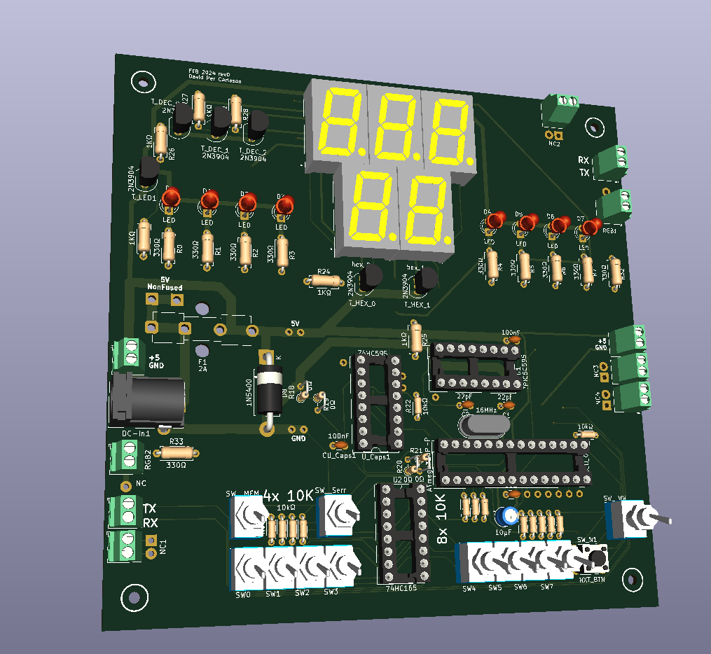
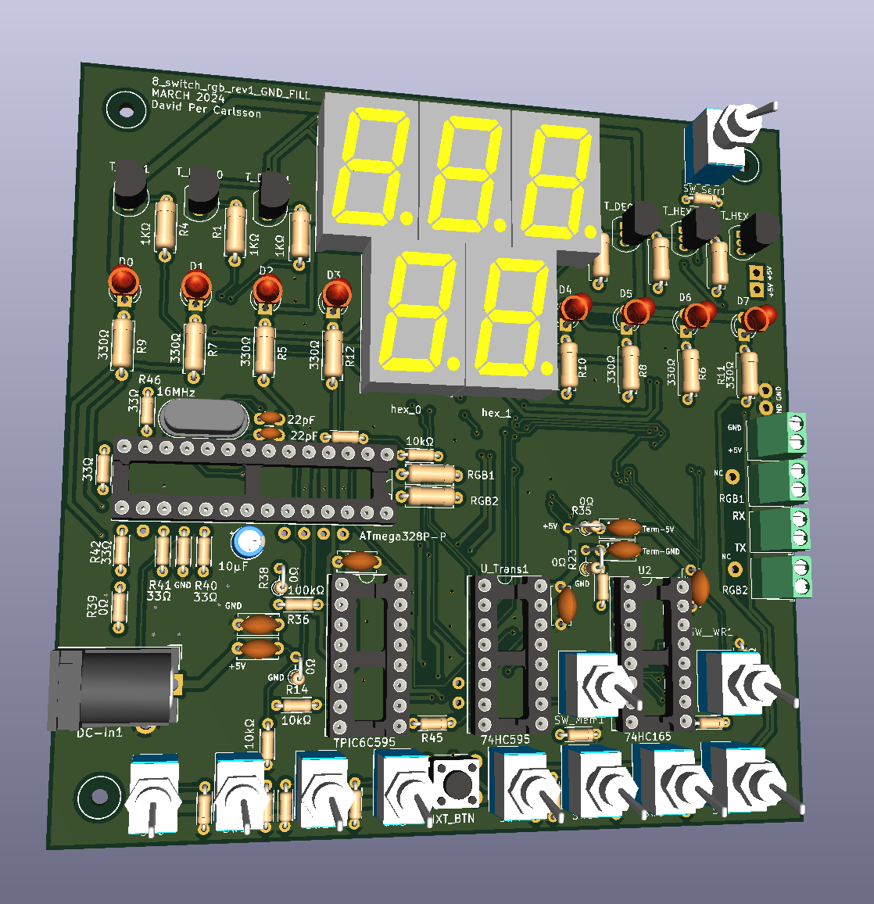

# Table of contents
- [Table of contents](#table-of-contents)
- [1.1 Introduction:](#11-introduction)
- [1.2 Demonstration:](#12-demonstration)
  - [1.2.1 English:](#121-english)
  - [1.2.1 Swedish:](#121-swedish)
- [2 Design and process:](#2-design-and-process)
  - [2.1 Arduino](#21-arduino)
  - [2.2 KiCad](#22-kicad)
    - [2.2.1 Schematics and details:](#221-schematics-and-details)
      - [2.2.1.1 PCB rev0](#2211-pcb-rev0)
      - [2.2.1.2 PCB rev1](#2212-pcb-rev1)
    - [2.2.2 Custom Footprint SPDT-Switch:](#222-custom-footprint-spdt-switch)
    - [2.2.3 Custom Footprint 7-segment Display:](#223-custom-footprint-7-segment-display)
  - [2.3 FreeCAD](#23-freecad)
- [3 Assembly:](#3-assembly)
- [4 Programming and bootloading:](#4-programming-and-bootloading)
  - [4.1 Bootloading:](#41-bootloading)
  - [4.2 Programming:](#42-programming)
  - [4.3 Programing the MCU for PCB Revision 1:](#43-programing-the-mcu-for-pcb-revision-1)

________________

# 1.1 Introduction:
This project was created to teach my niece the wonders of electicity and programming.
Here is a video trying to give and project overview and explain the process that made me go from 64 bit memory board to a "space-machine": 

# 1.2 Demonstration: 
## 1.2.1 English:
Using Revision 0: 

## 1.2.1 Swedish:
Better quality than the english one, using PCB revision 1:

___________
# 2 Design and process:
## 2.1 Arduino
No real design was put in here since the issues needing solving where clearly limited and modular in its nature, the process I choose was to solve issues limited in scope and carry out experiments with components in as modular of a manner as possible.
This is how the original prototype described in the video above ended up containing 3 ATmega-328's.

This approach did however result in many .ino files and duplicate code. The descision I made was to keep all of them; this will allow me to return 5-10 years from now and realize my process of thinking and working has changed and how, maybe I will write a book or blogpost about it. 

## 2.2 KiCad
### 2.2.1 Schematics and details:
The only major differences between the two schematics are that I have a filter on the data and clock-lines in revision 1. I also relabeled the decimal-displays from order "dec-2" to "dec-0" starting from upper left corner in revision 0, to the reversed (and ISO-standard) way of counting/indexing from 0 in the upper left corner.

I also left-out the fuse and some other things in order to conserve space.
#### 2.2.1.1 PCB rev0
Will not publish Gerbers because this version should never ever be built or produced, as can be viewed in this 30 second clip:

#### 2.2.1.2 PCB rev1
Gerbers availible for order in this directory:
https://github.com/MMDavito/8_switch_rgb/tree/master/KiCad/8_switch_rgb_pcb_revision_1/gerber_to_order

### 2.2.2 Custom Footprint SPDT-Switch:
The SPDT switch was purchased from digikey: https://www.digikey.se/sv/products/detail/adam-tech/SW-T3-2B-A-A3-S1/15284416  
And later electrokit: https://www.electrokit.com/vippomkopplare-sub-miniatyr-1-pol-on-on-lodoron-smts-102

These had to be changed, since the footprints I found where for the larger 6-Amp switch. If I where to refactor the PCB I would probably make the soldering-pads 20% larger for this footprint, or even more if DRC/Design-Rules-Checker would allow it.
The custom footprint can be found here: https://github.com/MMDavito/8_switch_rgb/tree/master/KiCad/resources/Switch_Custom.pretty
### 2.2.3 Custom Footprint 7-segment Display:
The display used was a 14mm CA display purchased in RED here: https://www.electrokit.com/en/led-display-7-seg-14mm-superrod-ca  
And green from here: https://www.electrokit.com/en/led-display-7-seg-14mm-gron-ca

The schematics, PCB and footprint label it as a HDSP-511, which is incorrect, buying HDSP-511 would lead to buying a display too tall and wide to fit.
The edited footprint and 3D .step file can be found here:
https://github.com/MMDavito/8_switch_rgb/tree/master/KiCad/resources/HDSP-511Y
## 2.3 FreeCAD
What started as a means to an end of making it simpler to mount the PCB to a piece of plywood ended up resulting in 4 different design for holders and 3-5 different tools for making assembly simpler.

This process and designs are detailed in this readme:
https://github.com/MMDavito/8_switch_rgb/tree/master/FreeCad/README.MD
____________
# 3 Assembly:
Will be covered in a later update somewhere before June 2024.
_____________
# 4 Programming and bootloading:
I used this library to allow me to install bootloader and program the attiny https://github.com/MCUdude/MiniCore
## 4.1 Bootloading:
To get the atmega328 become programeable one needs to install a bootloader to it:  
Here is the instruction I used: https://www.instructables.com/How-to-Burn-the-Arduino-BootLoader-on-to-a-AtMega3/

Here is a alternative version: https://www.instructables.com/Burning-the-Bootloader-on-ATMega328-using-Arduino-/

In future I might adjust the board I have made from a prototype-board or order a PCB that allow me to not need a arduino UNO connected with dupont-wires to install the bootloader to the atmega-328.

## 4.2 Programming:
Somehow I managed to program the board using diagrams and information found on this page:
https://www.instructables.com/USB-to-Serial-TTL-Adapter-to-Program-ATmega328p/

And this video: 
https://youtu.be/tiETAwkxnmw?si=Nhqw3l6RTYwrkvaB

Skiming through above links I realize that neither really shows my process of programming the MCUs, and I should probably order a PCB and create a project to detail this.

Until I find the time for creating that PCB I here bellow attach a picture comparing the breadboard vs with the soldered prototype one.

I later attached the prototype-board to a piece of plywood to make it even more robust.

## 4.3 Programing the MCU for PCB Revision 1:
Using above instructions, load this sketch onto the MCU:
https://github.com/MMDavito/8_switch_rgb/blob/master/troubleshooting_and_revision_1/2024-03-07_8_switch_rgb_pcb_rev1/8_switch_rgb_rev_1_master_control/8_switch_rgb_rev_1_master_control.ino